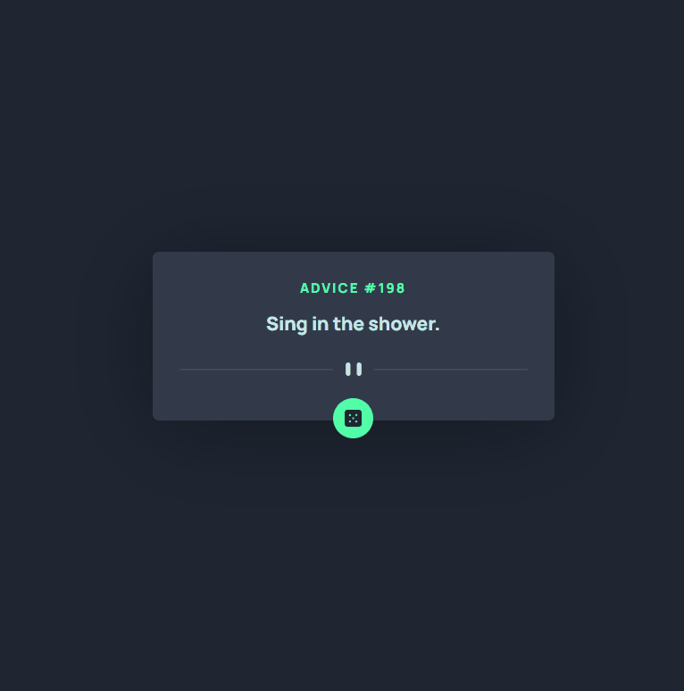

<h1 align = 'center'> Advice generator app </h1>

<br>

 <p align = 'center'></p>

## About the Project

This is a project from [Frontend Mentor](https://www.frontendmentor.io/challenges/advice-generator-app-QdUG-13db/hub) that generates a random advice when clicked on the dice button.
I did this project using an API named [Advice Slip](https://api.adviceslip.com/) that gives to me the random advices data when clicked on the dice button.

📱 The project is also responsive for the most of the devices.

## Built with


## Getting Started

To run the project on your machine reads the following steps.

### Installation

1 - Clone the repo

```
git clone https://github.com/jhowbrcg/advice-generator-react.git
```

2 - Install NPM packages

```
npm install
```

### Run

After the installation, to run the project on your machine, write in your command line the following code.

```
npm run dev
```

<br>

<br>

<br>

<!-- <h3 align = 'center'><a href = 'https://jhowbrcg.github.io/advice-generator-app/'>See the project</a></h3> -->

<div align= 'left'>

<br>

## Creator

| Author                                                                                                                                      |
| ------------------------------------------------------------------------------------------------------------------------------------------- |
| <a target="_blank" href="https://github.com/JhowBRCG"><br></a> |
| &nbsp; &nbsp; &nbsp; Jhonathan                                                                                                              |

</div>
